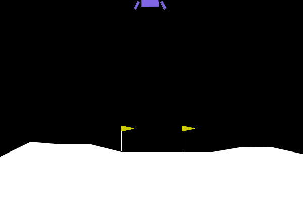
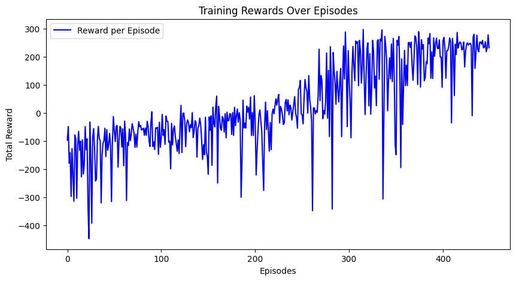
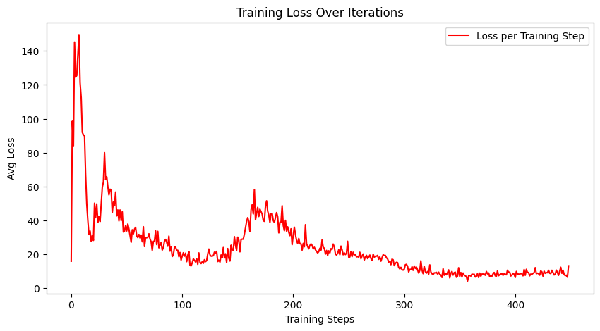

# LunarLander
## Model Demonstration – Results from this projec

## Purpose
The goal of this project is to implement and train a Deep Q-Learning (DQN) agent to solve the LunarLander-v3 environment from OpenAI Gymnasium. The agent learns to land a spacecraft safely using reinforcement learning techniques with experience replay, target network updates, and epsilon-greedy exploration.

This project demonstrates:
- Application of reinforcement learning in discrete action spaces
- Performance tracking through reward and loss visualization

## Results
After training for 449 episodes, the DQN agent was able to:
- Achieve average rewards above the Gym's "solved" threshold of **200**
- Exhibit consistent soft landings across multiple trials
- Reduce training loss over time, indicating stable convergence

### Reward Curve

### Loss Curve

